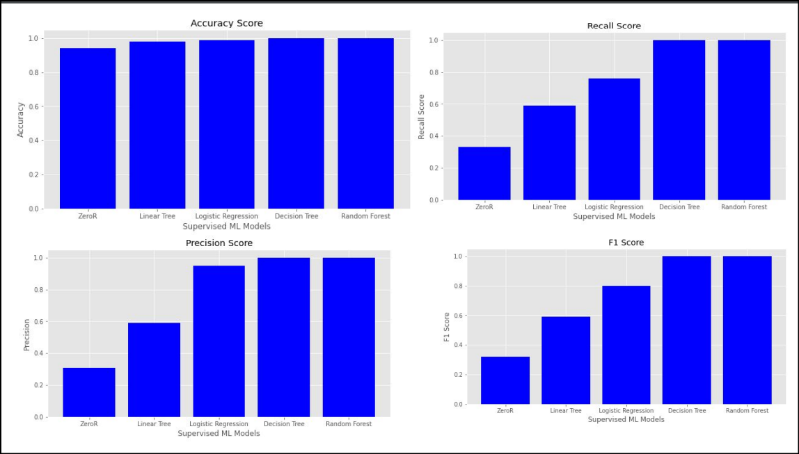

## Analysis of Earthquake Forecasting Using Supervised Machine Learning Classifiers

Here is a detailed summary of the project -- [Download PDF](earthquake_analysis.pdf)

Objectives:
- To implement various supervised machine learning algorithms on an earthquake
dataset
- To determine the correctness of model information based on accuracy,
precision, recall, Mathew’s coefficient and F1 score
- To classify the earthquake instances from the dataset based on fatal, mild and
moderate earthquakes

